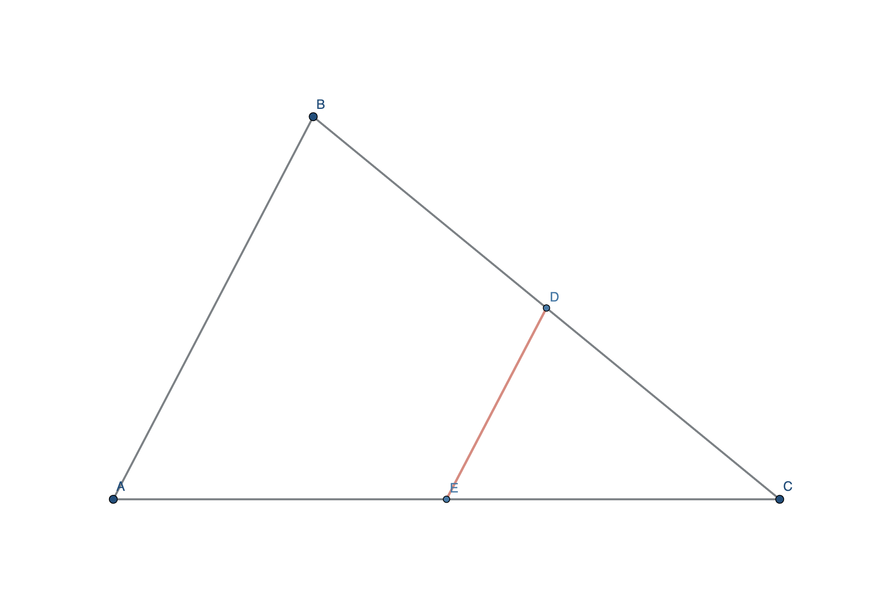

# GeoGebra Geometry for Codex

Generate verified, importable GeoGebra `.ggb` constructions from geometry problem text, screenshots, or LaTeX.

The plugin is designed for olympiad and competition geometry diagrams where the picture should be mathematically faithful without suggesting accidental relationships.



## Features

- Exports genuine `.ggb` files through the official GeoGebra engine.
- Reads problem text, LaTeX, or screenshots.
- Encodes hypotheses as dynamic construction dependencies.
- Checks conclusions numerically or with GeoGebra `ProveDetails`.
- Audits accidental collinearity, concurrency, parallelism, perpendicularity, equal lengths, equal angles, special angles, concyclicity, and crowded points.
- Searches valid coordinate layouts to avoid misleading diagrams.
- Round-trip loads every generated `.ggb` before delivery.
- Exports PNG, SVG, GeoGebra XML, and optional native TikZ.

## Install from the marketplace

After this repository has been published, add it as a Codex marketplace:

```bash
codex plugin marketplace add Mars723/codex-geogebra-geometry
codex plugin add geogebra-geometry@codex-geogebra
```

Start a new Codex task after installation so the plugin's skill is loaded.

## Install from a local clone

```bash
git clone https://github.com/Mars723/codex-geogebra-geometry.git
cd codex-geogebra-geometry
codex plugin marketplace add .
codex plugin add geogebra-geometry@codex-geogebra
```

## Use

Invoke the skill explicitly:

```text
$generate-geogebra-geometry
```

Example prompts:

```text
Use $generate-geogebra-geometry to turn this problem into a verified .ggb file.
```

```text
Read this geometry screenshot, construct the diagram in GeoGebra, verify the stated conclusion, and check for accidental collinearity.
```

Normal deliverables are:

- an importable `.ggb`;
- a PNG preview;
- an `.audit.json` verification report;
- optional SVG, GeoGebra XML, and TikZ.

## Example

The repository includes a triangle-midline example in [`examples/triangle-midline`](examples/triangle-midline):

- [`triangle-midline.ggb`](examples/triangle-midline/triangle-midline.ggb)
- [`triangle-midline.png`](examples/triangle-midline/triangle-midline.png)
- [`triangle-midline.audit.json`](examples/triangle-midline/triangle-midline.audit.json)
- [`triangle-midline.tex`](examples/triangle-midline/triangle-midline.tex)

The midline parallelism conclusion is symbolically verified and the generated `.ggb` passes round-trip loading.

## Requirements

- Codex with plugin support.
- Chrome, Chromium, or Edge for the headless GeoGebra engine.
- An installed GeoGebra app is preferred for fully offline generation.
- If GeoGebra is not installed, the generator can use GeoGebra's official CDN when network access is available.
- Playwright is discovered from the Codex runtime or a local installation.

## How verification works

The construction, theorem conclusion, and visual appearance are treated separately:

- construction relations are checked against the generated instance;
- supported conclusions use `ProveDetails` for symbolic verification;
- the visual audit identifies undeclared relationships that merely look true.

A numerically true statement is never reported as a symbolic proof.

## Documentation

- [Chinese research and implementation summary](docs/research-summary.zh-CN.md)
- [Skill workflow](plugins/geogebra-geometry/skills/generate-geogebra-geometry/SKILL.md)
- [Construction specification](plugins/geogebra-geometry/skills/generate-geogebra-geometry/references/spec-format.md)
- [Diagram-quality rules](plugins/geogebra-geometry/skills/generate-geogebra-geometry/references/diagram-quality.md)
- [Engine notes](plugins/geogebra-geometry/skills/generate-geogebra-geometry/references/engine-notes.md)
- [TikZ output](plugins/geogebra-geometry/skills/generate-geogebra-geometry/references/latex-output.md)

## Development

Validate the plugin:

```bash
python3 /path/to/plugin-creator/scripts/validate_plugin.py \
  plugins/geogebra-geometry
```

Build the included example:

```bash
node plugins/geogebra-geometry/skills/generate-geogebra-geometry/scripts/build_geogebra.mjs \
  --spec plugins/geogebra-geometry/skills/generate-geogebra-geometry/assets/spec-template.json \
  --out-dir /tmp/geogebra-example
```

## License

MIT
