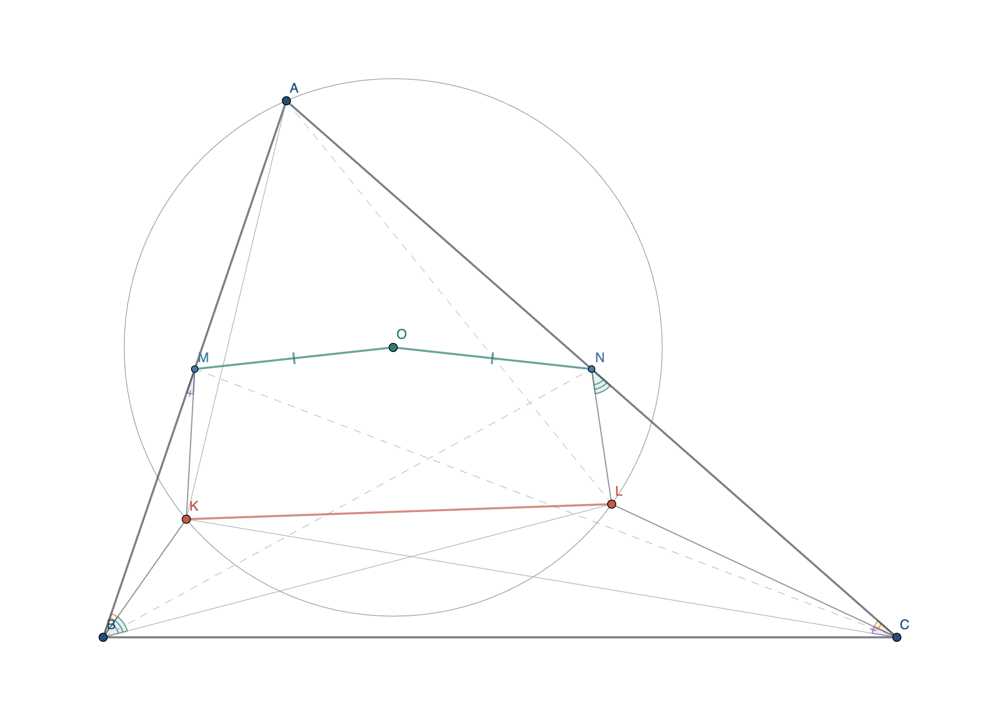

# IMO 2026 Problem 2 — GeoGebra showcase

> **Naming note:** “IMO G2” is used informally here to mean the geometry problem in slot 2. The official contest label is **IMO 2026 Problem 2**, not a shortlist G2 identifier.

Source: [IMO official problems page](https://www.imo-official.org/problems/?column=year&language=en&order=desc).

## Problem snapshot

In triangle `ABC`, points `M` and `N` are the midpoints of `AB` and `AC`. Interior points `K` and `L` satisfy the required containment conditions and

\[
\angle KBA=\angle ACL,\qquad
\angle LBK=\angle LNC,\qquad
\angle LCK=\angle BMK.
\]

Point `O` is the circumcenter of triangle `AKL`; the target conclusion is `OM = ON`.

## Download and inspect

| Artifact | Purpose |
| --- | --- |
| [`imo-2026-problem-2.ggb`](imo-2026-problem-2.ggb) | Dynamic construction, ready to open in GeoGebra |
| [`imo-2026-problem-2.png`](imo-2026-problem-2.png) | High-resolution preview |
| [`imo-2026-problem-2.svg`](imo-2026-problem-2.svg) | Vector preview |
| [`imo-2026-problem-2.spec.json`](imo-2026-problem-2.spec.json) | Reproducible generator input |
| [`imo-2026-problem-2.audit.json`](imo-2026-problem-2.audit.json) | Strict engine audit and round-trip report |
| [`visible-segment-audit.json`](visible-segment-audit.json) | Supplemental finite-segment visual audit |
| [`imo-2026-problem-2.geogebra.xml`](imo-2026-problem-2.geogebra.xml) | Extracted GeoGebra construction XML |

## Verification summary

- Generated with the plugin's `strict` mode.
- All 31 construction, hypothesis, interior, boundary-exclusion, and conclusion checks pass.
- The exported `.ggb` round-trips through GeoGebra with 62 objects, no missing objects, and no undefined objects.
- In this legal representative configuration, `|OM-ON|` is approximately `1.01e-13`. This conclusion is verified numerically; the symbolic attempt is recorded as unresolved, not presented as a proof.
- The engine reports no severe accidental relations. The supplemental finite-segment pass reports no medium- or high-severity visible collinearity, parallelism, perpendicularity, concyclicity, crowding, or concurrency issue.
- Seven low-severity near-equality warnings remain in the full audit. They are not asserted as facts and are visually distinguished by color, line style, and explicit angle markings.

This is an audited example configuration satisfying the problem's hypotheses. It is not a proof of the theorem and not a parameterized model of every valid configuration.
